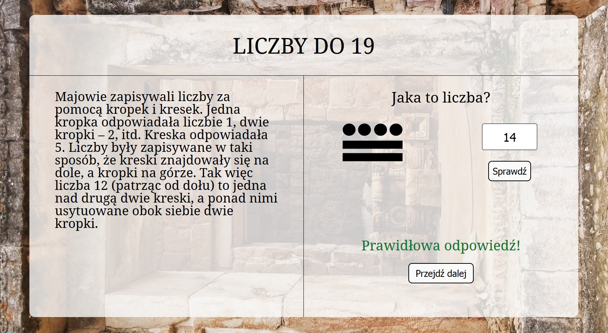

# Maya-Counting-System

Educational web application about ancient Maya numeral system. This is a graduation project made during programming bootcamp in Coders Lab IT school.

Demo version can be seen here: https://surmia.github.io/Maya-Counting-System/

## Technologies used:

* HTML5
* CSS3
* Sass
* JavaScript
* ReactJS
* Webpack
* Firebase

## Preview:

